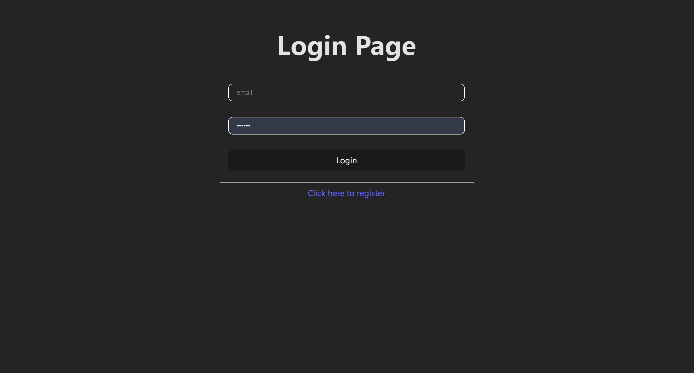
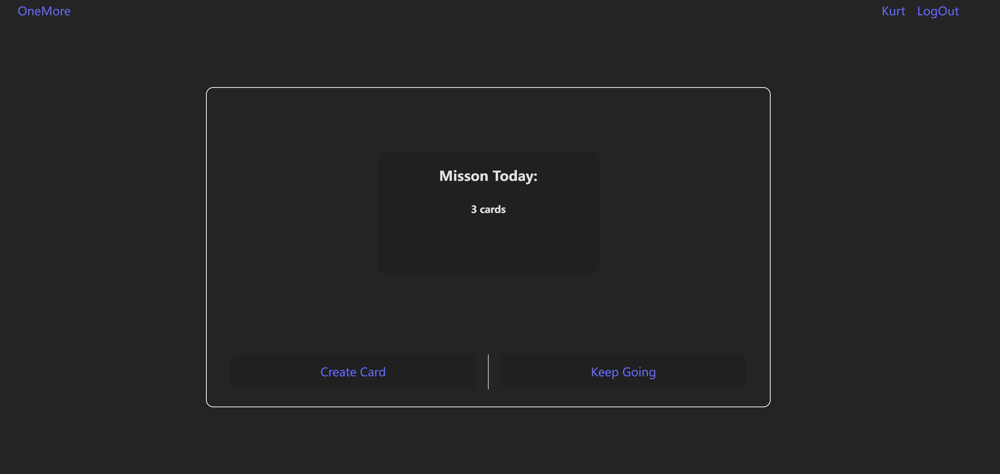
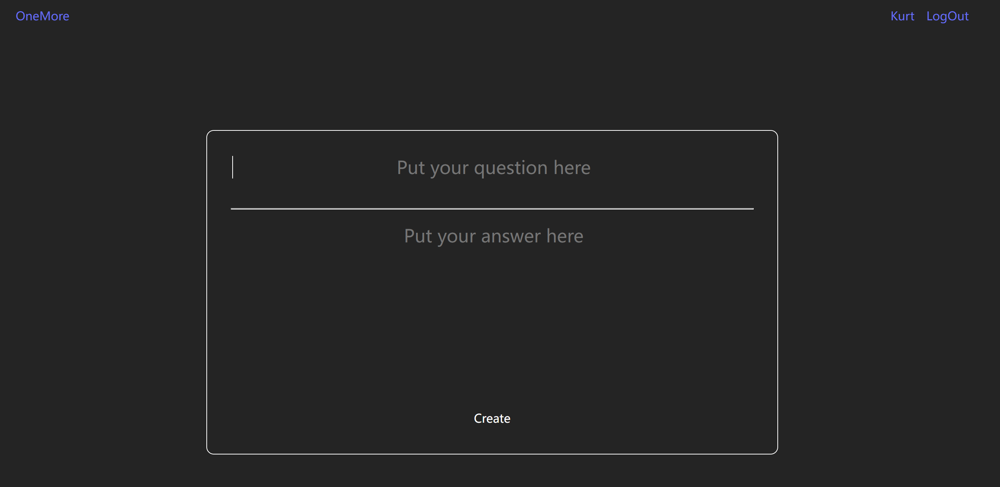
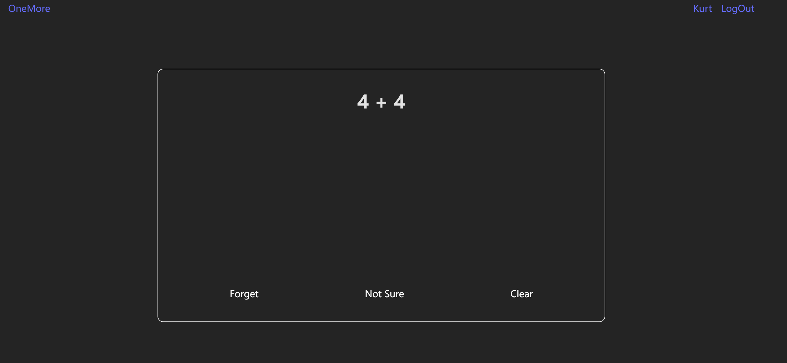
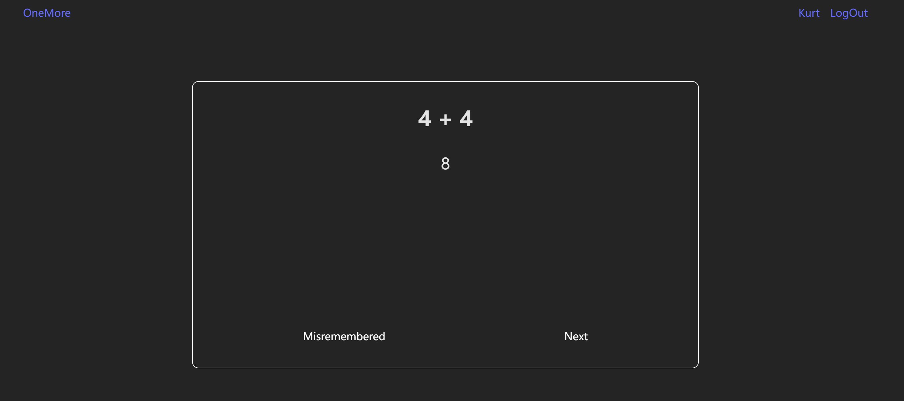
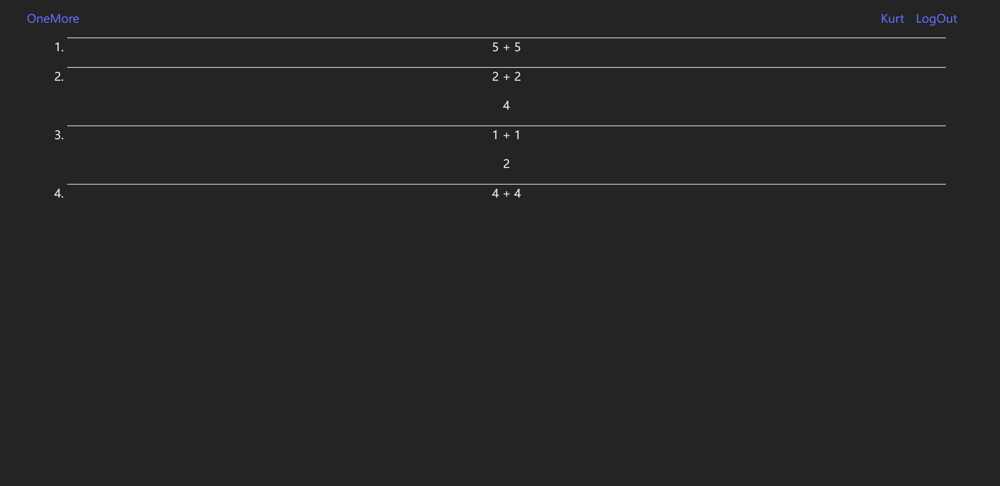

# [OneMoreStep](https://chenwenhao1108.github.io/onemore)

[A flashcard web app](https://chenwenhao1108.github.io/onemore) built by React.js and firebase.

## Inspiration

When I was learning computer science, there were always too many knowledge to remember. So I have to re-watch the 2 hour long tutorial video again and again, sometime it's just a tiny point I can't recall but I need to delve into the whole video to find the context and the point.

So I start wondering it would be so great if there is an app to help me remember all the knowledge perpetually, and give me the functionality to quickly review all the knowledge I have learned.

So an flashcard app occurred to me, using the forgetting curve to continuously show you the knowledge you have learned in a proper pace and you can have your own real account to save all the cards you've made and quickly review them.

It may be just making another wheel, but I think it's a great way to training my web development skill and a great final project idea.

## Distinctiveness and Complexity

### Distinctiveness

It basically uses not only all the front-end knowledge taught in the CS50 Web course like HTML, CSS and JavaScript, but also almost all the basic React knowledge and some very popular and advanced React knowledge like React Router and Context API.

And firebase is a real life database. I used the firestore API to store the information of all cards and Authentication API to store all the information of all users so that user can register or log in their own account and have their very own cards.

### Complexity

This single page web app includes register page, log in page, home page, create card page, recite cards page and cards overview page total 6 pages.

#### Login page

You can register and login your real account and update to firebase in this page.


#### Home page

There is a dashboard that shows your mission today.


#### Create card page

Every card has two parts, the question and the answer.
You can easily create cards as you want, and all the new created cards will update to the firestore, not only the card itself, but also the time when the card should be showed up again. When just create the card, you can immediately recite it.


#### Recite page

After you create some cards, you should recite them until you totally remember them.
It won't spend to much time because the cards won't show up everyday. Instead, it depends on how solid you remember them, the solider, the less they will show up.

The card won't show you the answer part until you click any one of the three buttons down the card.
When recite every single card, you have 3 different choices: Clear, Not really, Forget. Every choice consistent with a different calculating logic to calculate when the card should show up next time.


Assuming that you are always clear about this card, the card show up schedule should be 1 / 3 / 7 / 12 / 30 / 60 days later. After the sixth time the logic will consider you have deeply remembered the card's knowledge, so it won't show up again.

Once you click the forget or misremembered button, you will back to the day when you just created the card.


#### cards overview page

Every account has their own cards, and if you click you username right up the corner, you will be led to a page where shows your all cards there.
Same all cards will just show the question part, but you can click any of them to toggle the answer part.


## SetUP

```shell script
git clone https://github.com/chenwenhao1108/onemore.git
cd onemore
npm install

```

When the dependent packages are installed, you can run this command to run your server.
`npm run dev`

## Deploy

The app is deployed using Github pages:
[OneMore](https://chenwenhao1108.github.io/onemore)

## Finally

Thanks for all people make [CS50's Web Programming with Python and JavaScript](https://www.edx.org/learn/web-development/harvard-university-cs50-s-web-programming-with-python-and-javascript) possible. Especially, thanks for [Brain Yu](https://www.edx.org/bio/brian-yu)'s excellent lecture and his "great question", which motivate me to finish the course study.
